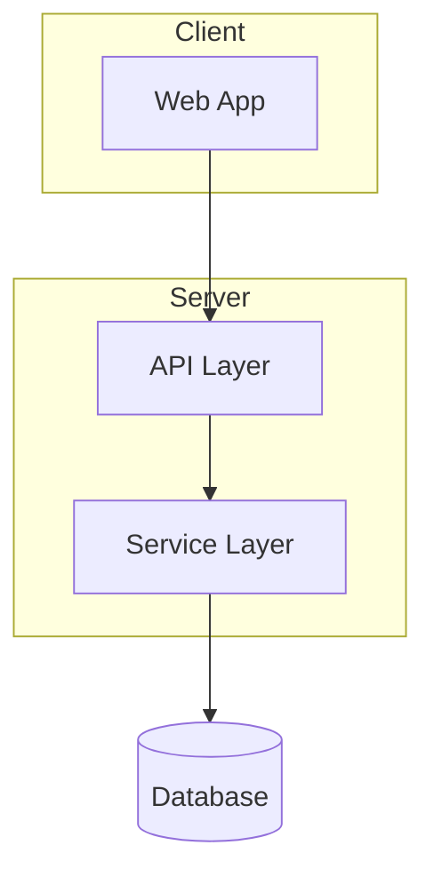
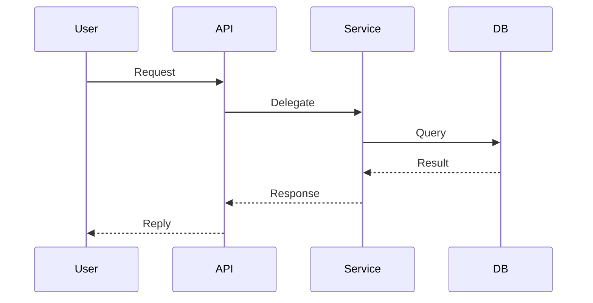
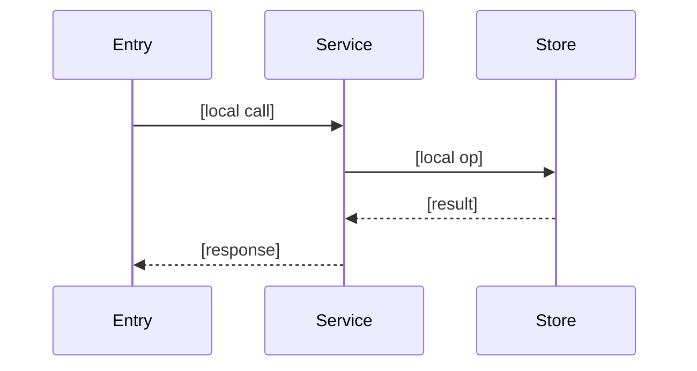

# map-codebase + map-feature (Phase 1) Implementation Plan

> **For agentic workers:** REQUIRED SUB-SKILL: Use superpowers:subagent-driven-development (recommended) or superpowers:executing-plans to implement this plan task-by-task. Steps use checkbox (`- [ ]`) syntax for tracking.

**Goal:** Ship Phase 1 of the codebase-mapping upgrade — a new `/spec-kit:map-feature` skill, AI-navigable report templates (frontmatter v2 + frozen-heading anchors + nav index + bounded mermaid), a shared spawn-prompt, and the corresponding `map-codebase` upgrades.

**Architecture:** Two plugin-owned skills under `skills/`, sharing one spawn-prompt/schema file and a set of upgraded Markdown templates under `templates/codebase/`. No runtime code, no test framework — these are skill/instruction and template documents. Verification is structural (grep) plus a manual plugin-load smoke and a dogfood run.

**Tech Stack:** Markdown + YAML frontmatter (mermaid fenced blocks). Claude Code plugin skill format. No Python/Node runtime (per CLAUDE.md). Bash tool for grep/git verification on Windows.

**Spec:** `docs/superpowers/specs/2026-05-31-map-codebase-map-feature-upgrade-design.md` (Phase 1 = §4; Phase 2 deferred per §5).

---

## Conventions for this plan

- These files are **documents**, not executable code. "Failing test" = a grep that does NOT yet find the new content; "passing test" = the same grep finding it after the edit. This is the honest analog of red→green for doc work.
- All templates live under `${CLAUDE_PLUGIN_ROOT}/templates/codebase/` — **plugin-owned, never clobbered by upstream sync** (outside `assets/specify/`).
- Commit after every task. Branch: stay on `master` (current branch; not the default `main`).
- **Anchor rule (load-bearing):** templates own their headings, so GitHub-slugified anchors are stable *by construction*. Headings are frozen; any `&` in a heading is reworded to `and` so anchors stay clean (no `--` double-hyphen).

## Frozen-heading anchor contract (reference for all tasks)

| Doc | Frozen headings → anchors |
|-----|---------------------------|
| README | `what-this-is`, `documents`, `start-here` |
| ARCHITECTURE | `system-overview`, `pattern-overview`, `layers`, `data-flow`, `key-abstractions`, `entry-points`, `error-handling`, `cross-cutting-concerns` |
| TECH-STACK | `languages`, `runtime`, `frameworks`, `key-dependencies`, `configuration`, `platform-requirements` |
| STRUCTURE | `directory-layout`, `directory-purposes`, `key-file-locations`, `naming-conventions`, `where-to-add-new-code`, `special-directories`, `navigation-index` |
| CONVENTIONS | `naming-patterns`, `code-style`, `import-organisation`, `error-handling`, `logging`, `comments`, `function-design`, `module-design` |
| TESTING | `test-framework`, `test-file-organisation`, `test-structure`, `mocking`, `fixtures-and-factories`, `coverage`, `test-types`, `common-patterns` |
| INTEGRATIONS | `apis-and-external-services`, `data-storage`, `authentication-and-identity`, `monitoring-and-observability`, `cicd-and-deployment`, `environment-configuration`, `webhooks-and-callbacks` |
| CONCERNS | `tech-debt`, `known-bugs`, `security-considerations`, `performance-bottlenecks`, `fragile-areas`, `dependencies-at-risk`, `test-coverage-gaps` |
| FEATURE-CONTEXT | `blast-radius`, `architectural-fit`, `where-to-add-code`, `patterns-to-reuse`, `local-conventions`, `integration-touchpoints`, `risks-and-tests-to-keep-green`, `open-questions` |

> **Decision:** all generated template/document content is **English** (headings *and* body
> prose), matching the other 8 docs. Vietnamese is used only in chat with the user, never inside
> generated files. English headings also keep anchors stable.

---

## Task 1: Shared spawn-prompt + frontmatter v2 schema

**Files:**
- Create: `templates/codebase/agent-prompt.md`

- [ ] **Step 1: Write the shared file**

Create `templates/codebase/agent-prompt.md` with this exact content:

````markdown
# Codebase-mapping agent prompt (shared)

Both `/spec-kit:map-codebase` and `/spec-kit:map-feature` spawn their reading agents from this
skeleton. The orchestrator fills the `<...>` slots before dispatching. **The orchestrator never
reads codebase files directly — agents read; the orchestrator plans and synthesises.**

## Spawn-prompt skeleton

> You are a codebase mapper with the **<FOCUS>** focus. Your final message is a RETURN VALUE,
> not a human reply — keep it to a ~10-line summary of what you wrote.
>
> **Read:** load files incrementally as needed — do NOT read the whole tree up front. Scope: <SCOPE>.
>
> **Hard rules:**
> - Never open `.env*`, credential files, private keys, or anything secret. Note env var *names* only.
> - Cite every finding with a real path in backticks, e.g. `` `src/services/user.ts` ``.
> - Report only what the code shows. Mark inferences "suspected". Invent nothing.
> - 80–250 lines per document. Prescriptive, not padded.
>
> **Write** each output with the Write tool (never heredocs) to <OUTPUTS>. Read each template at
> <TEMPLATES> first — the fenced "File Template" block is the exact structure to produce.
>
> **Frontmatter v2 (mandatory, top of every output file):**
> ```yaml
> ---
> schema_version: 1
> doc: <DOC_ID>
> analysis_date: <DATE>
> generated_by: <SKILL>
> source_sha: <SHA>
> sections:
>   - { id: <anchor>, summary: "<one line: what this section answers>" }
> ---
> ```
> Use the **frozen canonical headings** so anchors are stable (see the skill's anchor contract).
> README and STRUCTURE additionally carry Tier-3 index fields: `modules`, `entry_points`,
> `key_files: [{ path, purpose, see }]`.
>
> **Discipline:** frontmatter is an INDEX of the body — every field must be derivable from the
> doc's prose. Do not put facts only in frontmatter. Mermaid diagrams are high-level (modules /
> layers / primary flows), never one-node-per-file, and visualise prose already written.
>
> **Return:** list the files you wrote and their line counts.

## Slot reference

| Slot | map-codebase | map-feature |
|------|--------------|-------------|
| `<FOCUS>` | tech / arch / quality / concerns | blast-radius scout |
| `<DOC_ID>` | TECH-STACK, ARCHITECTURE, … | FEATURE-CONTEXT |
| `<SKILL>` | `/spec-kit:map-codebase` | `/spec-kit:map-feature` |
| `<OUTPUTS>` | `docs/codebase/*.md` | `specs/<feature>/codebase-context.md` |
| `<TEMPLATES>` | the per-focus templates | `feature-context.md` |
| `<SCOPE>` | whole repo or sub-path | the feature blast radius |
| `<SHA>` | `git rev-parse --short HEAD` | `git rev-parse --short HEAD` |
````

- [ ] **Step 2: Verify the file exists and contains the schema**

Run: `grep -c "schema_version" templates/codebase/agent-prompt.md`
Expected: `1` (or more) — non-zero confirms the frontmatter schema is present.

Run: `grep -c "orchestrator never reads" templates/codebase/agent-prompt.md`
Expected: `1` — confirms the Cartographer discipline line is present.

- [ ] **Step 3: Commit**

```bash
git add templates/codebase/agent-prompt.md
git commit -m "feat(map-codebase): add shared spawn-prompt + frontmatter v2 schema

Co-Authored-By: Claude Opus 4.8 (1M context) <noreply@anthropic.com>"
```

---

## Task 2: Upgrade `architecture.md` (frontmatter v2 + mermaid)

**Files:**
- Modify: `templates/codebase/architecture.md`

- [ ] **Step 1: Verify the old bold-date line is present (pre-state)**

Run: `grep -n "Analysis Date:" templates/codebase/architecture.md`
Expected: one hit on the `**Analysis Date:** [YYYY-MM-DD]` line inside the File Template.

- [ ] **Step 2: Replace the H1 + date line with frontmatter v2 and add System Overview**

Edit `templates/codebase/architecture.md`. Replace:

```markdown
# Architecture

**Analysis Date:** [YYYY-MM-DD]

## Pattern Overview
```

with:

```markdown
---
schema_version: 1
doc: ARCHITECTURE
analysis_date: [YYYY-MM-DD]
generated_by: /spec-kit:map-codebase
source_sha: [short-sha]
sections:
  - { id: system-overview, summary: "[high-level module/layer diagram]" }
  - { id: pattern-overview, summary: "[overall pattern + key characteristics]" }
  - { id: layers, summary: "[conceptual layers and dependencies]" }
  - { id: data-flow, summary: "[request/execution lifecycle]" }
  - { id: key-abstractions, summary: "[core concepts and patterns]" }
  - { id: entry-points, summary: "[where execution starts]" }
  - { id: error-handling, summary: "[error strategy and patterns]" }
  - { id: cross-cutting-concerns, summary: "[logging, validation, auth]" }
---

# Architecture

## System Overview

[High-level architecture. Modules/layers only — never one node per file.]



[Adapt the skeleton to the real architecture. Delete subgraphs that don't apply.]

## Pattern Overview
```

- [ ] **Step 3: Add a sequenceDiagram skeleton under Data Flow**

Edit `templates/codebase/architecture.md`. Replace:

```markdown
## Data Flow

[Describe the typical request/execution lifecycle]
```

with:

```markdown
## Data Flow

[Describe the typical request/execution lifecycle. Add a sequenceDiagram for each primary flow
(request, auth). High-level participants only.]


```

- [ ] **Step 4: Verify post-state**

Run: `grep -c "schema_version" templates/codebase/architecture.md`
Expected: `1`

Run: `grep -c "## System Overview" templates/codebase/architecture.md`
Expected: `1`

Run: `grep -c '```mermaid' templates/codebase/architecture.md`
Expected: `2` (System Overview graph + Data Flow sequence)

Run: `grep -c "^\*\*Analysis Date:\*\*" templates/codebase/architecture.md`
Expected: `0` (the bold line is gone — now in frontmatter)

- [ ] **Step 5: Commit**

```bash
git add templates/codebase/architecture.md
git commit -m "feat(map-codebase): frontmatter v2 + mermaid in architecture template

Co-Authored-By: Claude Opus 4.8 (1M context) <noreply@anthropic.com>"
```

---

## Task 3: Upgrade `structure.md` (frontmatter v2 Tier-3 + Navigation Index)

**Files:**
- Modify: `templates/codebase/structure.md`

- [ ] **Step 1: Replace H1 + date line with Tier-3 frontmatter**

Edit `templates/codebase/structure.md`. Replace:

```markdown
# Codebase Structure

**Analysis Date:** [YYYY-MM-DD]

## Directory Layout
```

with:

```markdown
---
schema_version: 1
doc: STRUCTURE
analysis_date: [YYYY-MM-DD]
generated_by: /spec-kit:map-codebase
source_sha: [short-sha]
sections:
  - { id: directory-layout, summary: "[top-level tree]" }
  - { id: directory-purposes, summary: "[what lives in each dir]" }
  - { id: key-file-locations, summary: "[entry points, config, core, tests, docs]" }
  - { id: naming-conventions, summary: "[file/dir naming rules]" }
  - { id: where-to-add-new-code, summary: "[insertion points by change type]" }
  - { id: special-directories, summary: "[generated/build dirs]" }
  - { id: navigation-index, summary: "[path → purpose → doc anchor table]" }
key_files:
  - { path: [path], purpose: [one line], see: ARCHITECTURE#layers }
---

# Codebase Structure

## Directory Layout
```

- [ ] **Step 2: Add the Navigation Index section before the closing footer**

Edit `templates/codebase/structure.md`. Replace:

```markdown
## Special Directories

[Any directories with special meaning or generation.]

**[Directory]:**
- Purpose: [e.g., "Generated code", "Build output"]
- Source: [e.g., "Auto-generated by X"]
- Committed: [Yes/No — in .gitignore?]

---
```

with:

```markdown
## Special Directories

[Any directories with special meaning or generation.]

**[Directory]:**
- Purpose: [e.g., "Generated code", "Build output"]
- Source: [e.g., "Auto-generated by X"]
- Committed: [Yes/No — in .gitignore?]

## Navigation Index

[Inverted index of key dirs/files — module-level, capped. Agents grep this; humans read it as a
per-file table of contents. `see` deep-links into another doc's frozen anchor.]

| Path | Purpose | See |
|------|---------|-----|
| [`src/auth/`] | [Authentication & session] | [ARCHITECTURE#layers] |
| [`src/api/routes.ts`] | [HTTP route declarations] | [ARCHITECTURE#entry-points] |

---
```

- [ ] **Step 3: Verify post-state**

Run: `grep -c "## Navigation Index" templates/codebase/structure.md`
Expected: `1`

Run: `grep -c "key_files:" templates/codebase/structure.md`
Expected: `1`

Run: `grep -c "^\*\*Analysis Date:\*\*" templates/codebase/structure.md`
Expected: `0`

- [ ] **Step 4: Commit**

```bash
git add templates/codebase/structure.md
git commit -m "feat(map-codebase): frontmatter v2 + Navigation Index in structure template

Co-Authored-By: Claude Opus 4.8 (1M context) <noreply@anthropic.com>"
```

---

## Task 4: Upgrade `readme.md` (rich Tier-3 frontmatter)

**Files:**
- Modify: `templates/codebase/readme.md`

- [ ] **Step 1: Replace the H1 + the two bold metadata lines with frontmatter**

Edit `templates/codebase/readme.md`. Replace:

```markdown
# Codebase Map

**Analysis Date:** [YYYY-MM-DD]
**Generated by:** `/spec-kit:map-codebase`

## What this is
```

with:

```markdown
---
schema_version: 1
doc: README
analysis_date: [YYYY-MM-DD]
generated_by: /spec-kit:map-codebase
source_sha: [short-sha]
modules: [list, the, top-level, modules]
entry_points: [path/to/main, path/to/other-entry]
docs: [ARCHITECTURE, TECH-STACK, STRUCTURE, CONVENTIONS, TESTING, INTEGRATIONS, CONCERNS]
sections:
  - { id: what-this-is, summary: "[one-paragraph project description]" }
  - { id: documents, summary: "[table of the 7 detail docs]" }
  - { id: start-here, summary: "[first-day orientation bullets]" }
---

# Codebase Map

## What this is
```

- [ ] **Step 2: Verify post-state**

Run: `grep -c "modules:" templates/codebase/readme.md`
Expected: `1`

Run: `grep -c "entry_points:" templates/codebase/readme.md`
Expected: `1`

Run: `grep -c "^\*\*Generated by:\*\*" templates/codebase/readme.md`
Expected: `0`

- [ ] **Step 3: Commit**

```bash
git add templates/codebase/readme.md
git commit -m "feat(map-codebase): rich Tier-3 frontmatter in readme template

Co-Authored-By: Claude Opus 4.8 (1M context) <noreply@anthropic.com>"
```

---

## Task 5: Upgrade the remaining 5 templates (Core + Navigation frontmatter)

**Files:**
- Modify: `templates/codebase/tech-stack.md`
- Modify: `templates/codebase/conventions.md`
- Modify: `templates/codebase/testing.md`
- Modify: `templates/codebase/integrations.md`
- Modify: `templates/codebase/concerns.md`

Each gets a frontmatter block replacing its `# <H1>` + `**Analysis Date:** [YYYY-MM-DD]` lines.

- [ ] **Step 1: `tech-stack.md`** — replace `# Technology Stack\n\n**Analysis Date:** [YYYY-MM-DD]\n\n## Languages` with:

```markdown
---
schema_version: 1
doc: TECH-STACK
analysis_date: [YYYY-MM-DD]
generated_by: /spec-kit:map-codebase
source_sha: [short-sha]
sections:
  - { id: languages, summary: "[primary/secondary languages]" }
  - { id: runtime, summary: "[runtime + package manager]" }
  - { id: frameworks, summary: "[core/testing/build frameworks]" }
  - { id: key-dependencies, summary: "[5-10 critical deps]" }
  - { id: configuration, summary: "[env + build config]" }
  - { id: platform-requirements, summary: "[dev/prod platform needs]" }
---

# Technology Stack

## Languages
```

- [ ] **Step 2: `conventions.md`** — replace `# Coding Conventions\n\n**Analysis Date:** [YYYY-MM-DD]\n\n## Naming Patterns` with:

```markdown
---
schema_version: 1
doc: CONVENTIONS
analysis_date: [YYYY-MM-DD]
generated_by: /spec-kit:map-codebase
source_sha: [short-sha]
sections:
  - { id: naming-patterns, summary: "[file/function/variable/type naming]" }
  - { id: code-style, summary: "[formatting + linting]" }
  - { id: import-organisation, summary: "[import order + path aliases]" }
  - { id: error-handling, summary: "[throw/catch strategy]" }
  - { id: logging, summary: "[framework + patterns]" }
  - { id: comments, summary: "[when/how to comment]" }
  - { id: function-design, summary: "[size/params/returns]" }
  - { id: module-design, summary: "[exports + barrel files]" }
---

# Coding Conventions

## Naming Patterns
```

- [ ] **Step 3: `testing.md`** — replace `# Testing Patterns\n\n**Analysis Date:** [YYYY-MM-DD]\n\n## Test Framework` with:

```markdown
---
schema_version: 1
doc: TESTING
analysis_date: [YYYY-MM-DD]
generated_by: /spec-kit:map-codebase
source_sha: [short-sha]
sections:
  - { id: test-framework, summary: "[runner + assertions + run commands]" }
  - { id: test-file-organisation, summary: "[location + naming]" }
  - { id: test-structure, summary: "[suite organisation + patterns]" }
  - { id: mocking, summary: "[framework + what to mock]" }
  - { id: fixtures-and-factories, summary: "[test data patterns]" }
  - { id: coverage, summary: "[targets + how to view]" }
  - { id: test-types, summary: "[unit/integration/e2e]" }
  - { id: common-patterns, summary: "[async/error/snapshot]" }
---

# Testing Patterns

## Test Framework
```

- [ ] **Step 4: `integrations.md`** — first reword the `&` headings to `and` for clean anchors, then add frontmatter. Replace `# External Integrations\n\n**Analysis Date:** [YYYY-MM-DD]\n\n## APIs & External Services` with:

```markdown
---
schema_version: 1
doc: INTEGRATIONS
analysis_date: [YYYY-MM-DD]
generated_by: /spec-kit:map-codebase
source_sha: [short-sha]
sections:
  - { id: apis-and-external-services, summary: "[third-party APIs + SDKs]" }
  - { id: data-storage, summary: "[databases, file storage, caching]" }
  - { id: authentication-and-identity, summary: "[auth provider + OAuth]" }
  - { id: monitoring-and-observability, summary: "[error tracking, analytics, logs]" }
  - { id: cicd-and-deployment, summary: "[hosting + CI pipeline]" }
  - { id: environment-configuration, summary: "[env var names per environment]" }
  - { id: webhooks-and-callbacks, summary: "[incoming/outgoing webhooks]" }
---

# External Integrations

## APIs and External Services
```

Then rename the remaining `&` headings in the same file (each is unique, replace individually):
- `## Authentication & Identity` → `## Authentication and Identity`
- `## Monitoring & Observability` → `## Monitoring and Observability`
- `## CI/CD & Deployment` → `## CI/CD and Deployment`
- `## Webhooks & Callbacks` → `## Webhooks and Callbacks`

- [ ] **Step 5: `concerns.md`** — replace `# Codebase Concerns\n\n**Analysis Date:** [YYYY-MM-DD]\n\n## Tech Debt` with:

```markdown
---
schema_version: 1
doc: CONCERNS
analysis_date: [YYYY-MM-DD]
generated_by: /spec-kit:map-codebase
source_sha: [short-sha]
sections:
  - { id: tech-debt, summary: "[shortcuts + fix approaches]" }
  - { id: known-bugs, summary: "[symptoms + triggers]" }
  - { id: security-considerations, summary: "[risks + mitigations]" }
  - { id: performance-bottlenecks, summary: "[slow ops + causes]" }
  - { id: fragile-areas, summary: "[what breaks easily]" }
  - { id: dependencies-at-risk, summary: "[deprecated/unmaintained deps]" }
  - { id: test-coverage-gaps, summary: "[untested areas + risk]" }
---

# Codebase Concerns

## Tech Debt
```

- [ ] **Step 6: Verify all five**

Run: `grep -l "schema_version" templates/codebase/tech-stack.md templates/codebase/conventions.md templates/codebase/testing.md templates/codebase/integrations.md templates/codebase/concerns.md | wc -l`
Expected: `5`

Run: `grep -rn " & " templates/codebase/integrations.md`
Expected: no hits inside `##` headings (the `&` in "SDK/Client" bullet text is fine; confirm no `## ... & ...` heading remains).

Run: `grep -c "^\*\*Analysis Date:\*\*" templates/codebase/tech-stack.md templates/codebase/conventions.md templates/codebase/testing.md templates/codebase/integrations.md templates/codebase/concerns.md`
Expected: `0` for each file.

- [ ] **Step 7: Commit**

```bash
git add templates/codebase/tech-stack.md templates/codebase/conventions.md templates/codebase/testing.md templates/codebase/integrations.md templates/codebase/concerns.md
git commit -m "feat(map-codebase): frontmatter v2 on remaining 5 templates

Co-Authored-By: Claude Opus 4.8 (1M context) <noreply@anthropic.com>"
```

---

## Task 6: New `feature-context.md` template

**Files:**
- Create: `templates/codebase/feature-context.md`

- [ ] **Step 1: Write the template**

Create `templates/codebase/feature-context.md` with this exact content:

````markdown
# Feature Context Template

Template for `specs/<feature>/codebase-context.md` — the blast-radius scout output of
`/spec-kit:map-feature`. Maps the **existing** code a feature will touch, before plan/implement.

**Purpose:** Ground planning and implementation in real code. Every claim cites a real path in
backticks. All content is English (headings and body prose); Vietnamese is for chat only.

---

## File Template

```markdown
---
schema_version: 1
doc: FEATURE-CONTEXT
feature: [slug]
analysis_date: [YYYY-MM-DD]
generated_by: /spec-kit:map-feature
source_sha: [short-sha]
scope_paths: [src/area/, src/other.ts]
entry_points: [path/to/entry]
blast_radius_files:
  - { path: [path], purpose: [one line] }
sections:
  - { id: blast-radius, summary: "[existing files the feature touches]" }
  - { id: architectural-fit, summary: "[layers crossed + local flow]" }
  - { id: where-to-add-code, summary: "[insertion points by convention]" }
  - { id: patterns-to-reuse, summary: "[similar impls to mirror]" }
  - { id: local-conventions, summary: "[naming/structure/testing here]" }
  - { id: integration-touchpoints, summary: "[DB/API/services in scope]" }
  - { id: risks-and-tests-to-keep-green, summary: "[fragile spots + tests]" }
  - { id: open-questions, summary: "[needs human confirmation]" }
---

# Feature Context: [Feature Name]

## Blast Radius

[Existing files this feature will read or modify. Cite each path. One line of why each matters.]

| File | Why it's in scope |
|------|-------------------|
| [`path`] | [Reason] |

## Architectural Fit

[Which conceptual layers the feature crosses, the local data flow, and constraints it must obey.]

- Layers crossed: [Route] → [Service] → [Repository]   — cite a path per layer
- Constraints: [e.g., "validation at boundary", "no DB calls from controllers"]
- Full map: [→ docs/codebase/ARCHITECTURE.md#layers — only if map-codebase has run]

[LINK-OR-DERIVE: if docs/codebase/ARCHITECTURE.md exists, deep-link its anchors/diagram and draw
ONLY the local flow below. Otherwise derive a mini local-architecture here.]



## Where to Add Code

[Insertion points for the new code, following existing convention. Cite the directory/file.]

## Patterns to Reuse

[Existing similar implementations to mirror — cite them so the implementer copies the real shape.]

## Local Conventions

[Naming/structure/testing conventions specific to this slice. Cite examples.]

## Integration Touchpoints

[External systems touched in scope: DB tables, API endpoints, services. Env var *names* only.]

## Risks and Tests to Keep Green

[Fragile spots in the blast radius and the existing tests that must stay passing. Cite paths.]

## Open Questions

[Anything inferred, marked "suspected", that needs human confirmation before implementing.]

---

*Feature context: [date]. Generated by /spec-kit:map-feature before plan/implement.*
```
````

- [ ] **Step 2: Verify**

Run: `grep -c "doc: FEATURE-CONTEXT" templates/codebase/feature-context.md`
Expected: `1`

Run: `grep -c '```mermaid' templates/codebase/feature-context.md`
Expected: `1`

Run: `grep -E "^## (Blast Radius|Architectural Fit|Open Questions)" templates/codebase/feature-context.md | wc -l`
Expected: `3`

- [ ] **Step 3: Commit**

```bash
git add templates/codebase/feature-context.md
git commit -m "feat(map-feature): add feature-context output template

Co-Authored-By: Claude Opus 4.8 (1M context) <noreply@anthropic.com>"
```

---

## Task 7: New `map-feature/SKILL.md`

**Files:**
- Create: `skills/map-feature/SKILL.md`

- [ ] **Step 1: Write the skill**

Create `skills/map-feature/SKILL.md` with this exact content:

````markdown
---
name: map-feature
description: Scout the existing code a feature will touch — its blast radius — before planning or implementing. Reads the active feature spec (or a sub-path) and writes specs/<feature>/codebase-context.md with the relevant files, architectural fit, where to add code, patterns to reuse, and risks. Use before /spec-kit:plan or /spec-kit:implement, when starting or enhancing a feature, or when the user asks to scout/recon the code for a feature.
argument-hint: "(optional) sub-path or feature description to scope the scout; defaults to the active spec"
user-invocable: true
disable-model-invocation: false
tools: Read, Glob, Grep, Bash, Write, Edit, Agent
---

# /spec-kit:map-feature

You scout the **blast radius** of a feature — the existing code it will touch — and write one
focused `codebase-context.md` so `/spec-kit:plan` and `/spec-kit:implement` are grounded in real
code. This is reconnaissance of what *exists*, read through the lens of what the feature *wants*.

## Hard rules (apply to you and every agent)

- **Never read secrets.** Do not open `.env*`, credential files, or private keys. Note env var
  *names* only, never values.
- **Cite real paths.** Every finding references an actual file/dir in backticks. If you can't
  point to it, don't claim it.
- **Evidence over guesswork.** Report what the code shows. Mark inferences "suspected".
- **One focused doc.** Target 80–200 lines — the blast radius, not the whole repo.
- **Date.** Use today's date for `analysis_date`.

## Execution

### Step 0 — Resolve scope

Resolve what to scout, in this order:
1. **Explicit arg sub-path** (e.g. `map-feature src/auth`) → scope to that path. Reject paths
   containing `..`, a leading `/`, or shell metacharacters.
2. **Active feature spec**: read `.specify/feature.json` → `feature_directory`. Read its
   `spec.md` to understand what the feature does, and derive **search seeds** (keywords, entity
   names, actions) from it.
3. **Neither**: ask the user for a sub-path or a one-line feature description, then derive seeds.

Determine the output path:
- In a speckit project with a resolved feature directory → `specs/<feature>/codebase-context.md`.
- Otherwise → `docs/codebase/feature-<slug>-context.md`.

If a `codebase-context.md` already exists at the target, report its `analysis_date` and ask
whether to refresh or skip before overwriting.

### Step 1 — Bound the blast radius (you, on the main thread)

From the search seeds, use `Glob`/`Grep` to find the files the feature will touch — definitions,
call sites, similar existing features, tests in the area. Keep it cheap; do not read deeply here.
Produce a candidate file list. **Do not read codebase files for analysis yourself** — that is the
agent's job (orchestrator plans, agent reads).

Get the current commit for `source_sha`:
```bash
git rev-parse --short HEAD
```

### Step 2 — Check for an existing codebase map

Check whether `docs/codebase/ARCHITECTURE.md` exists. Pass the answer to the agent so it follows
the **link-or-derive** rule: if it exists, the agent deep-links the relevant `ARCHITECTURE.md`
anchors and draws only the local flow; if not, it derives a mini local-architecture inline.

### Step 3 — Dispatch the scout agent

Read `${CLAUDE_PLUGIN_ROOT}/templates/codebase/agent-prompt.md` and fill the skeleton with the
**blast-radius scout** focus. Dispatch **one `Agent`** (use `subagent_type: "Explore"`). Scale to
two agents only if the blast radius spans clearly separable areas.

Fill the slots: `<FOCUS>` = blast-radius scout; `<DOC_ID>` = FEATURE-CONTEXT;
`<SKILL>` = `/spec-kit:map-feature`; `<OUTPUTS>` = the resolved output path;
`<TEMPLATES>` = `${CLAUDE_PLUGIN_ROOT}/templates/codebase/feature-context.md`;
`<SCOPE>` = the candidate file list + scope paths; `<SHA>` = the short sha from Step 1.

Add to the agent prompt: the feature intent (summarised from `spec.md` or the user's
description), the candidate file list, and whether `ARCHITECTURE.md` exists (for link-or-derive).

### Step 4 — Write and report

After the agent returns, confirm `codebase-context.md` was written. Report:
- The output path and its line count.
- A 3-5 line summary of the blast radius.
- That `/spec-kit:plan` and `/spec-kit:implement` can now read this file for grounding.

Do **not** run git and do **not** touch `AGENTS.md` — this artifact is feature-scoped and
ephemeral; it is read directly by plan/implement, not registered for global discovery.

## Speckit integration (optional hook)

`map-feature` can run automatically before planning. Register an **optional** hook in
`.specify/extensions.yml`:

```yaml
hooks:
  before_plan:
    - extension: map-feature
      command: speckit.map.feature
      optional: true
      description: "Scout the feature's blast radius before planning"
```

`speckit.map.feature` resolves to `/spec-kit:map-feature` (strip `speckit.`, dots → hyphens,
prepend `/spec-kit:`). `optional: true` means it is *suggested*, never forced. The same can be
registered under `before_implement`.

## Notes

- Plugin-only (not part of the spec-kit upstream payload). Works best inside a speckit project
  but also runs on a bare sub-path.
- Shares the spawn-prompt and frontmatter schema with `/spec-kit:map-codebase` via
  `templates/codebase/agent-prompt.md`.
````

- [ ] **Step 2: Verify name matches folder and no stale cross-refs**

Run: `grep -H "^name:" skills/map-feature/SKILL.md`
Expected: `skills/map-feature/SKILL.md:name: map-feature`

Run: `grep -c "/speckit-" skills/map-feature/SKILL.md`
Expected: `0`

- [ ] **Step 3: Commit**

```bash
git add skills/map-feature/SKILL.md
git commit -m "feat(map-feature): add feature blast-radius scout skill

Co-Authored-By: Claude Opus 4.8 (1M context) <noreply@anthropic.com>"
```

---

## Task 8: Upgrade `map-codebase/SKILL.md`

**Files:**
- Modify: `skills/map-codebase/SKILL.md`

- [ ] **Step 1: Add `source_sha` capture + size guardrail to Step 1 recon**

Edit `skills/map-codebase/SKILL.md`. Replace:

```markdown
### Step 1 — Quick recon (you, on the main thread)

Do a lightweight pass so the agents share a baseline. Keep it cheap:
- Top-level layout: `Glob` the root and one level down.
- Stack signals: locate manifest/lockfiles (`package.json`, `pyproject.toml`, `go.mod`, `Cargo.toml`, etc.) and the primary language.
- Entry points and test directories.

Do not read deeply here — that's the agents' job.
```

with:

```markdown
### Step 1 — Quick recon (you, on the main thread)

Do a lightweight pass so the agents share a baseline. Keep it cheap:
- Top-level layout: `Glob` the root and one level down.
- Stack signals: locate manifest/lockfiles (`package.json`, `pyproject.toml`, `go.mod`, `Cargo.toml`, etc.) and the primary language.
- Entry points and test directories.
- **Capture the commit** for frontmatter `source_sha`: run `git rev-parse --short HEAD`.
- **Size guardrail.** Count tracked files: `git ls-files | wc -l` (fallback: `Glob` count). If the
  repo is large (roughly > 1500 files or you expect the full map to overflow a focus agent),
  **warn the user** and recommend either scoping with a sub-path argument
  (`/spec-kit:map-codebase <path>`) or mapping feature-by-feature with `/spec-kit:map-feature`.
  Proceed only after the user confirms. (Automatic token-budgeted scaling is a future Phase 2.)

Do not read deeply here — that's the agents' job.
```

- [ ] **Step 2: Point the agent dispatch at the shared spawn-prompt + frontmatter v2**

Edit `skills/map-codebase/SKILL.md`. Replace the agent prompt template block (the blockquote that
begins `> You are a codebase mapper with the **<FOCUS>** focus.` and ends
`> 5. Return a brief confirmation listing the files written and their line counts.`) with:

```markdown
> Read `${CLAUDE_PLUGIN_ROOT}/templates/codebase/agent-prompt.md` and follow its spawn-prompt
> skeleton. Fill the slots for the **<FOCUS>** focus: `<DOC_ID>` per the table below,
> `<SKILL>` = `/spec-kit:map-codebase`, `<OUTPUTS>` = `docs/codebase/<OUTPUTS>`,
> `<TEMPLATES>` = the focus templates under `${CLAUDE_PLUGIN_ROOT}/templates/codebase/`,
> `<SCOPE>` = <SCOPE>, `<DATE>` = <DATE>, `<SHA>` = <SHA>.
>
> Every output file MUST carry the frontmatter v2 block (schema_version, doc, analysis_date,
> generated_by, source_sha, sections) using the frozen canonical headings. README and STRUCTURE
> additionally carry Tier-3 fields (modules, entry_points, key_files). Obey the hard rules and the
> "frontmatter is an index of the body" discipline from the shared prompt. Return a brief
> confirmation listing the files written and their line counts.
```

- [ ] **Step 3: Pass `<SHA>` when dispatching**

Edit `skills/map-codebase/SKILL.md`. In the Step 2 dispatch instructions, replace:

```markdown
**Agent prompt template** (fill in `<FOCUS>`, `<TEMPLATES>`, `<OUTPUTS>`, `<SCOPE>`, `<DATE>`):
```

with:

```markdown
**Agent prompt template** (fill in `<FOCUS>`, `<TEMPLATES>`, `<OUTPUTS>`, `<SCOPE>`, `<DATE>`, `<SHA>`):
```

- [ ] **Step 4: Extend the AGENTS.md discovery block**

Edit `skills/map-codebase/SKILL.md`. Replace:

```markdown
- [Architecture](docs/codebase/ARCHITECTURE.md) · [Tech Stack](docs/codebase/TECH-STACK.md) · [Structure](docs/codebase/STRUCTURE.md)
- [Conventions](docs/codebase/CONVENTIONS.md) · [Testing](docs/codebase/TESTING.md) · [Integrations](docs/codebase/INTEGRATIONS.md) · [Concerns](docs/codebase/CONCERNS.md)
<!-- END spec-kit:codebase-map -->
```

with:

```markdown
- [Architecture](docs/codebase/ARCHITECTURE.md) · [Tech Stack](docs/codebase/TECH-STACK.md) · [Structure](docs/codebase/STRUCTURE.md)
- [Conventions](docs/codebase/CONVENTIONS.md) · [Testing](docs/codebase/TESTING.md) · [Integrations](docs/codebase/INTEGRATIONS.md) · [Concerns](docs/codebase/CONCERNS.md)

Per-feature blast-radius context may also exist at `specs/<feature>/codebase-context.md` (generated by `/spec-kit:map-feature`).
<!-- END spec-kit:codebase-map -->
```

- [ ] **Step 5: Verify post-state**

Run: `grep -c "agent-prompt.md" skills/map-codebase/SKILL.md`
Expected: `1` (or more) — the dispatch now references the shared prompt.

Run: `grep -c "source_sha" skills/map-codebase/SKILL.md`
Expected: `1` (or more).

Run: `grep -c "git ls-files" skills/map-codebase/SKILL.md`
Expected: `1` — the size guardrail is present.

Run: `grep -c "/speckit-" skills/map-codebase/SKILL.md`
Expected: `0`.

- [ ] **Step 6: Commit**

```bash
git add skills/map-codebase/SKILL.md
git commit -m "feat(map-codebase): shared prompt, frontmatter v2, source_sha, size guardrail

Co-Authored-By: Claude Opus 4.8 (1M context) <noreply@anthropic.com>"
```

---

## Task 9: Update CLAUDE.md (skill count + layout)

**Files:**
- Modify: `CLAUDE.md`

Adding `map-feature` makes 18 skills (was 17), and adds two template files. The Plugin Layout
section must reflect this.

- [ ] **Step 1: Bump the skill count and add map-feature**

Edit `CLAUDE.md`. Replace:

```
skills/                       17 skills
  init/                         Bootstrap .specify/ into project (new, plugin-only)
  init-agents-md/               Create/maintain AGENTS.md from codebase discovery (new, plugin-only)
  map-codebase/                 Scan repo -> docs/codebase/*.md onboarding map (new, plugin-only)
```

with:

```
skills/                       18 skills
  init/                         Bootstrap .specify/ into project (new, plugin-only)
  init-agents-md/               Create/maintain AGENTS.md from codebase discovery (new, plugin-only)
  map-codebase/                 Scan repo -> docs/codebase/*.md onboarding map (new, plugin-only)
  map-feature/                  Scout one feature's blast radius -> specs/<feature>/codebase-context.md (new, plugin-only)
```

- [ ] **Step 2: Note the new shared template + feature-context template**

Edit `CLAUDE.md`. Replace:

```
templates/codebase/           Codebase-map doc templates (plugin-owned; NOT upstream payload)
```

with:

```
templates/codebase/           Codebase-map doc templates + shared agent-prompt.md + feature-context.md (plugin-owned; NOT upstream payload)
```

- [ ] **Step 3: Extend the "Plugin-owned, never clobbered" rule**

Edit `CLAUDE.md`. Replace:

```
- **Plugin-owned, never clobbered.** `templates/codebase/` (used by `/spec-kit:map-codebase`) is authored by this plugin, NOT vendored from upstream. The sync step touches `assets/specify/` only -- it must never delete `templates/` or `skills/map-codebase/`.
```

with:

```
- **Plugin-owned, never clobbered.** `templates/codebase/` (used by `/spec-kit:map-codebase` and `/spec-kit:map-feature`) is authored by this plugin, NOT vendored from upstream. The sync step touches `assets/specify/` only -- it must never delete `templates/`, `skills/map-codebase/`, or `skills/map-feature/`.
```

- [ ] **Step 4: Verify**

Run: `grep -c "18 skills" CLAUDE.md`
Expected: `1`

Run: `grep -c "map-feature" CLAUDE.md`
Expected: `3` (layout line + sync rule + count context) — at least `2`.

- [ ] **Step 5: Commit**

```bash
git add CLAUDE.md
git commit -m "docs: register map-feature skill in CLAUDE.md plugin layout

Co-Authored-By: Claude Opus 4.8 (1M context) <noreply@anthropic.com>"
```

---

## Task 10: Full verification (smoke + sanity greps + dogfood)

**Files:** none modified — this task validates the whole Phase 1.

- [ ] **Step 1: Sanity greps (from CLAUDE.md)**

Run: `grep -rn "/speckit-" skills/`
Expected: no output (0 hits) — no stale cross-refs.

Run: `grep -H "^name:" skills/map-codebase/SKILL.md skills/map-feature/SKILL.md`
Expected: each `name:` matches its folder (`map-codebase`, `map-feature`).

- [ ] **Step 2: Frontmatter present on every template**

Run: `grep -L "schema_version" templates/codebase/*.md`
Expected: only `templates/codebase/agent-prompt.md` is listed (it documents the schema rather
than carrying a doc frontmatter). Every `readme/architecture/structure/tech-stack/conventions/testing/integrations/concerns/feature-context` template contains `schema_version`.

- [ ] **Step 3: Plugin loads — manual smoke**

Run (interactive, user confirms): `claude --plugin-dir C:/dev/spec-kit-system`
Then in-session: `/help`
Expected: both `/spec-kit:map-codebase` and `/spec-kit:map-feature` appear.

- [ ] **Step 4: Dogfood `map-feature` on this repo**

In the smoke session: `/spec-kit:map-feature skills/map-feature`
Expected: writes `docs/codebase/feature-map-feature-context.md` (no active spec → fallback path),
with the 8 frozen sections, frontmatter v2, and one mermaid local-flow block. Inspect it for
cited real paths and no secret values. Delete the dogfood artifact afterward if not wanted.

- [ ] **Step 5: Final confirmation**

Confirm all prior task commits are present:
Run: `git log --oneline -11`
Expected: the Phase 1 task commits (Tasks 1-9) plus this plan's commit are listed.

No commit for this task (verification only).

---

## Self-review notes (author)

- **Spec coverage:** §4.1 map-feature → Tasks 6,7. §4.2 templates AI-navigable → Tasks 2,3,4,5
  (frontmatter v2, frozen anchors, nav index) + §4.2(d) mermaid → Tasks 2,6. §4.3 spawn-prompt →
  Task 1 (+ wired in 7,8). §4.4 map-codebase upgrades → Task 8 (+ templates). §4.5 AGENTS.md →
  Task 8 Step 4. §4.6 hook → Task 7 (Speckit integration section). §4.7 build sequence → Task
  order. §4.8 verification → Task 10. CLAUDE.md skill-count drift → Task 9.
- **Placeholders:** the `[...]` tokens inside template bodies are intentional fill-in markers for
  runtime, not plan placeholders. All plan steps carry concrete content/commands.
- **Type/name consistency:** anchor ids in the contract table match the `sections:` ids in every
  template task and the `architectural-fit` / `data-flow` ids that map-feature's link-or-derive
  targets. Output paths (`specs/<feature>/codebase-context.md`, fallback
  `docs/codebase/feature-<slug>-context.md`) are identical across Tasks 6,7.
- **Phase boundary:** no scanner, no dynamic agent assignment, no incremental-regenerate — all
  deferred to Phase 2 per spec §5. `source_sha` (detection half) is included; regenerate-only is not.
