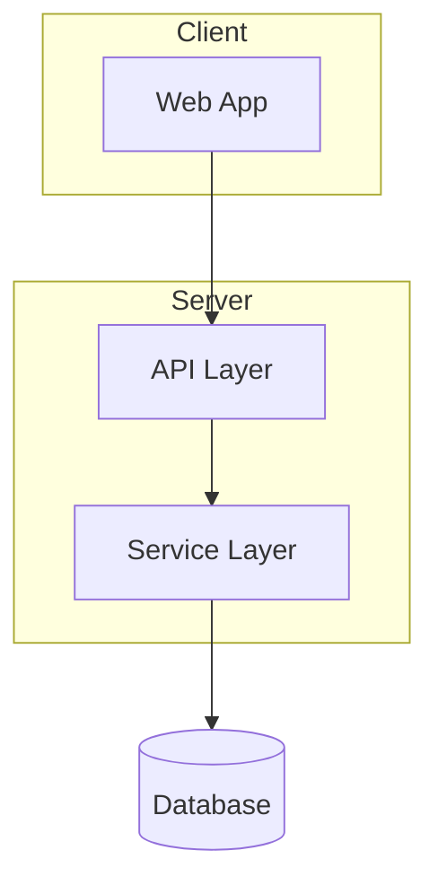
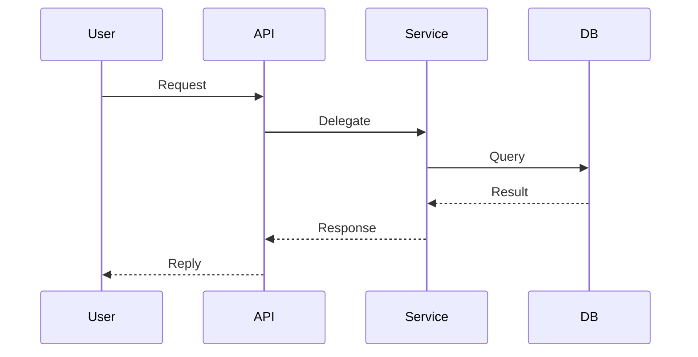

# Architecture Template

Template for `docs/codebase/ARCHITECTURE.md` — captures conceptual code organisation.

**Purpose:** Document how the code is organised at a conceptual level. Complements STRUCTURE.md (which shows physical file locations). Every claim must cite a real path in backticks, e.g. `` `src/services/user.ts` ``.

---

## File Template

```markdown
---
schema_version: 1
doc: ARCHITECTURE
analysis_date: [YYYY-MM-DD]
generated_by: /spec-kit:map-codebase
source_sha: [short-sha]
sections:
  - { id: system-overview, summary: "[high-level module/layer diagram]" }
  - { id: pattern-overview, summary: "[overall pattern + key characteristics]" }
  - { id: layers, summary: "[conceptual layers and dependencies]" }
  - { id: data-flow, summary: "[request/execution lifecycle]" }
  - { id: key-abstractions, summary: "[core concepts and patterns]" }
  - { id: entry-points, summary: "[where execution starts]" }
  - { id: error-handling, summary: "[error strategy and patterns]" }
  - { id: cross-cutting-concerns, summary: "[logging, validation, auth]" }
---

# Architecture

## System Overview

[High-level architecture. Modules/layers only — never one node per file.]



[Adapt the skeleton to the real architecture. Delete subgraphs that don't apply.]

## Pattern Overview

**Overall:** [Pattern name: e.g., "Monolithic CLI", "Serverless API", "Full-stack MVC"]

**Key Characteristics:**
- [Characteristic 1: e.g., "Single executable"]
- [Characteristic 2: e.g., "Stateless request handling"]
- [Characteristic 3: e.g., "Event-driven"]

## Layers

[Describe the conceptual layers and their responsibilities. Cite a representative path for each.]

**[Layer Name]:**
- Purpose: [What this layer does]
- Contains: [Types of code: e.g., "route handlers", "business logic"]
- Location: [`path/to/layer/`]
- Depends on: [What it uses: e.g., "data layer only"]
- Used by: [What uses it: e.g., "API routes"]

## Data Flow

[Describe the typical request/execution lifecycle. Add a sequenceDiagram for each primary flow
(request, auth). High-level participants only.]



**[Flow Name] (e.g., "HTTP Request", "CLI Command", "Event Processing"):**

1. [Entry point: e.g., "User runs command"] — [`path`]
2. [Processing step: e.g., "Router matches path"] — [`path`]
3. [Processing step: e.g., "Service executes logic"] — [`path`]
4. [Output: e.g., "Response returned"]

**State Management:**
- [How state is handled: e.g., "Stateless", "Database per request", "In-memory cache"]

## Key Abstractions

[Core concepts/patterns used throughout the codebase]

**[Abstraction Name]:**
- Purpose: [What it represents]
- Examples: [e.g., `UserService`, `ProjectService`]
- Pattern: [e.g., "Singleton", "Factory", "Repository"]

## Entry Points

**[Entry Point]:**
- Location: [`src/index.ts`]
- Triggers: [What invokes it: e.g., "CLI invocation", "HTTP request"]
- Responsibilities: [What it does: e.g., "Parse args, route to command"]

## Error Handling

**Strategy:** [How errors are handled: e.g., "Exception bubbling to top-level handler", "Per-route error middleware"]

**Patterns:**
- [Pattern: e.g., "try/catch at controller level"]
- [Pattern: e.g., "Error codes returned to user"]

## Cross-Cutting Concerns

**Logging:** [Approach: e.g., "Winston logger, injected per-request"]

**Validation:** [Approach: e.g., "Zod schemas at API boundary"]

**Authentication:** [Approach: e.g., "JWT middleware on protected routes"]

---

*Architecture analysis: [date]. Update when major patterns change.*
```
