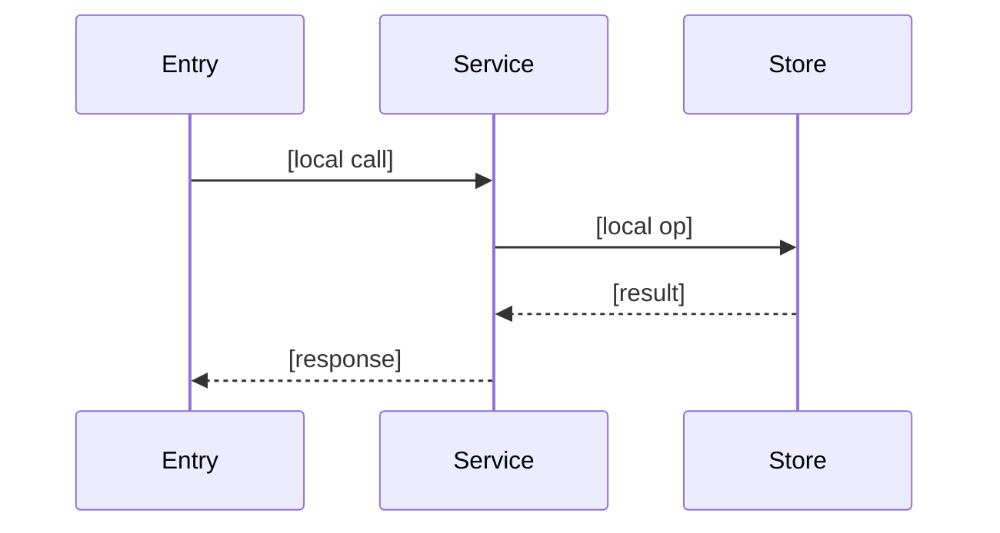

# Feature Context Template

Template for `specs/<feature>/codebase-context.md` — the blast-radius scout output of
`/spec-kit:map-feature`. Maps the **existing** code a feature will touch, before plan/implement.

**Purpose:** Ground planning and implementation in real code. Every claim cites a real path in
backticks. All content is English (headings and body prose); Vietnamese is for chat only.

---

## File Template

```markdown
---
schema_version: 1
doc: FEATURE-CONTEXT
feature: [slug]
analysis_date: [YYYY-MM-DD]
generated_by: /spec-kit:map-feature
source_sha: [short-sha]
scope_paths: [src/area/, src/other.ts]
entry_points: [path/to/entry]
blast_radius_files:
  - { path: [path], purpose: [one line] }
sections:
  - { id: blast-radius, summary: "[existing files the feature touches]" }
  - { id: architectural-fit, summary: "[layers crossed + local flow]" }
  - { id: where-to-add-code, summary: "[insertion points by convention]" }
  - { id: patterns-to-reuse, summary: "[similar impls to mirror]" }
  - { id: local-conventions, summary: "[naming/structure/testing here]" }
  - { id: integration-touchpoints, summary: "[DB/API/services in scope]" }
  - { id: risks-and-tests-to-keep-green, summary: "[fragile spots + tests]" }
  - { id: open-questions, summary: "[needs human confirmation]" }
---

# Feature Context: [Feature Name]

## Blast Radius

[Existing files this feature will read or modify. Cite each path. One line of why each matters.]

| File | Why it's in scope |
|------|-------------------|
| [`path`] | [Reason] |

## Architectural Fit

[Which conceptual layers the feature crosses, the local data flow, and constraints it must obey.]

- Layers crossed: [Route] → [Service] → [Repository]   — cite a path per layer
- Constraints: [e.g., "validation at boundary", "no DB calls from controllers"]
- Full map: [→ docs/codebase/ARCHITECTURE.md#layers — only if map-codebase has run]

[LINK-OR-DERIVE: if docs/codebase/ARCHITECTURE.md exists, deep-link its anchors/diagram and draw
ONLY the local flow below. Otherwise derive a mini local-architecture here.]



## Where to Add Code

[Insertion points for the new code, following existing convention. Cite the directory/file.]

## Patterns to Reuse

[Existing similar implementations to mirror — cite them so the implementer copies the real shape.]

## Local Conventions

[Naming/structure/testing conventions specific to this slice. Cite examples.]

## Integration Touchpoints

[External systems touched in scope: DB tables, API endpoints, services. Env var *names* only.]

## Risks and Tests to Keep Green

[Fragile spots in the blast radius and the existing tests that must stay passing. Cite paths.]

## Open Questions

[Anything inferred, marked "suspected", that needs human confirmation before implementing.]

---

*Feature context: [date]. Generated by /spec-kit:map-feature before plan/implement.*
```
